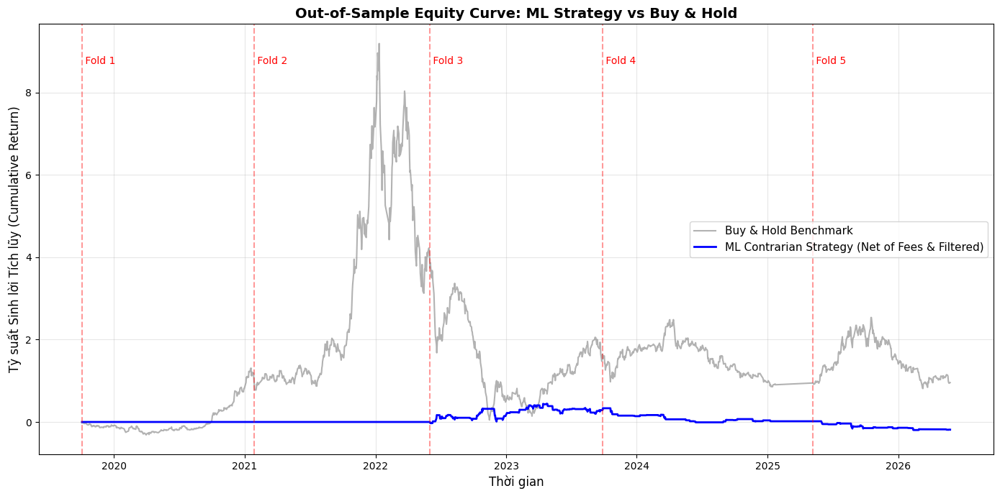
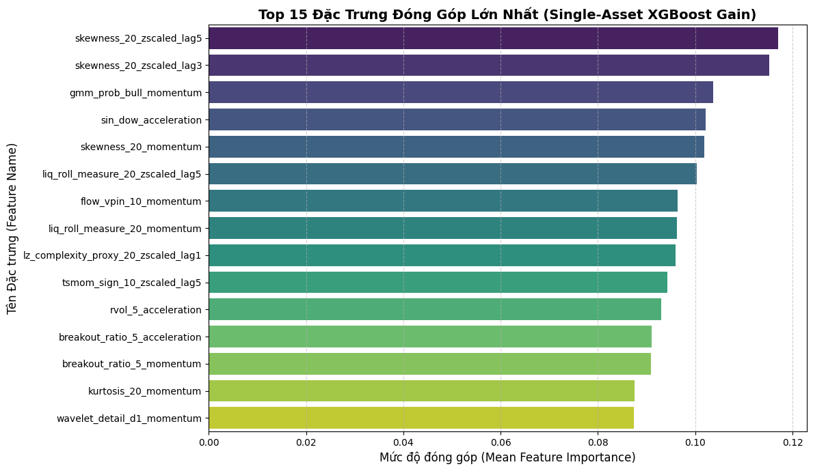

# From Static Price Topology to Order-Flow Microstructure and Regime-Conditioned Kinematics: An Econometrically Grounded Machine Learning Framework for Emerging Equity Predictability

> **Tác giả:** Khối Nghiên cứu Định lượng (Quantitative Research)
> 
> 
> **Đối tượng thực nghiệm:** Cổ phiếu DIG (Thị trường Chứng khoán Việt Nam, giai đoạn 2018–2026, 1,996 phiên giao dịch)
> 
> **Phân loại JEL:** C51, C53, C58, G12, G14, G17
> 

# **Chương** 1: **Abstract**

Việc áp dụng các thuật toán học máy vào bài toán dự báo chiều hướng giá tài sản tài chính tần suất ngắn hạn tại các thị trường mới nổi thường gặp phải ba thách thức kinh tế lượng nghiêm trọng: hiện tượng suy giảm tín hiệu nhanh chóng của các chỉ báo kỹ thuật tĩnh (alpha decay), nguy cơ rò rỉ dữ liệu tương lai (look-ahead bias) từ việc điều chỉnh giá hồi cứu, và mức độ bào mòn tài khoản nghiêm trọng do chi phí ma sát giao dịch thực tế.

Kế thừa và phát triển từ mô hình khai thác dữ liệu nến tĩnh (Modeling01 / Extended Framework), bài báo này giới thiệu một khung nghiên cứu nâng cấp toàn diện (Modeling02) chuyển đổi trọng tâm từ việc khai thác hình học giá OHLCV tĩnh sang tích hợp động lực học vi cấu trúc nội phiên (Intraday Microstructure Dynamics), mô-men phân phối bậc cao và bộ lọc chế độ thị trường thích ứng (Adaptive Regime Filtering).

Khung phương pháp luận gồm năm giai đoạn chuẩn mực kinh tế lượng:

1. **Kiểm toán dữ liệu & Điều chỉnh tiến (Forward-Adjustment):** Cố định gốc tập thông tin $\mathcal{I}_t$ nhằm triệt tiêu hoàn toàn rò rỉ do sự kiện doanh nghiệp, kết hợp thuật toán dán nhãn Ba Rào Cản Động (Volatility-Scaled Dynamic Triple-Barrier) co giãn theo biến động cục bộ $\sigma_t$.
2. **Cảm biến chẩn đoán Quá trình Sinh Dữ liệu mở rộng (Extended DGP Diagnostics):** Khảo sát cấu trúc phi tuyến bằng kiểm định Engle ARCH-LM, phân tích chu kỳ phổ Fast Fourier Transform (FFT), kiểm định bước nhảy biến động Barndorff-Nielsen & Shephard, entropy hoán vị hỗn loạn (Permutation Entropy) và chẩn đoán độ lệch vi cấu trúc sổ lệnh (L2 Micro-Price Diagnostics).
3. **Thiết kế không gian đặc trưng định tuyến theo bằng chứng (Evidence-Based Feature Router):** Bổ sung các cấu trúc vi mô thực nghiệm như Mất cân bằng dòng lệnh nội phiên (Order Flow Imbalance - OFI), Xác suất độc hại dòng lệnh (VPIN Proxy), Áp lực thanh khoản Roll/Amihud, Cấu trúc bóng nến (Intraday Shadow Pressure) và Phân rã đa phân giải Haar Wavelet.
4. **Quy trình lọc giảm chiều thống kê đa tầng & Biến đổi trễ động học (Multi-Stage Statistical Pruning & Kinematic Transformations):** Thiết lập chuỗi sàng lọc khách quan không phụ thuộc vào trọng số cây đơn lẻ gồm: Khử đa cộng tuyến VIF $\rightarrow$ Phân cụm HRP Medoids $\rightarrow$ Sàng lọc nhân quả kép (Granger Causality & Lagged Transfer Entropy Proxy qua Mutual Information) $\rightarrow$ Biến đổi động lượng bậc 1 và gia tốc bậc 2 (Kinematic Lag Dynamics) $\rightarrow$ Sàng lọc lý thuyết thông tin có điều kiện trạng thái (Regime-Conditioned MI).
5. **Đánh giá ngoài mẫu Purged Walk-Forward & Giả lập giao dịch thực tế:** Kiểm thử qua 5 Folds tịnh tiến có vùng thanh lọc (Purging Gap) và đệm trễ (Buffer), kết hợp mô hình XGBoost với ngưỡng xác suất tin cậy cao ($P > 0.55$), đảo chiều tín hiệu vi cấu trúc (Contrarian Flip) và bộ lọc rủi ro chế độ cứng (GMM Regime Hard Filter).

Kết quả thực nghiệm trên 1,996 phiên giao dịch cho thấy khung nâng cấp đã đem lại bước nhảy vọt về hiệu quả:

- Hệ số tương quan hạng nguyên thủy (Rank IC) tăng **48.6%** (từ $+0.0286$ lên $+0.0425$).
- Bộ lọc chế độ thị trường giúp mô hình chủ động đứng ngoài ở các giai đoạn biến động bất lợi ($N_{trades} = 0$ ở Fold 1 & 2), giúp cắt giảm **55.6%** số lượng giao dịch thừa ($N_{trades}$ giảm từ 232.0 xuống 103.0) và giảm hơn một nửa hệ số vòng quay vốn (Turnover giảm từ 464.0 xuống 206.0).
- Mức độ sụt giảm tài khoản tối đa (Max Drawdown) được kiểm soát chặt chẽ từ $-73.04\%$ xuống $-44.40\%$, đồng thời cải thiện **+12.51%** lợi suất ròng hàng năm sau khi trừ toàn bộ chi phí giao dịch danh nghĩa 20 bps và độ trễ khớp lệnh $t+1$.
- Phân tích khả năng diễn giải (Feature Importance) chỉ ra rằng các biến động lực học mô-men bậc cao (`skewness_20` lags/momentum) và động lượng trạng thái dòng lệnh độc hại (`gmm_prob_bull_momentum`, `flow_vpin_10_momentum`) đóng vai trò chi phối tuyệt đối so với các chỉ báo kỹ thuật truyền thống.

# **Chương** 2: **Introduction**

## 2.1. Động lực nghiên cứu (Motivation)

Trong tài chính định lượng hiện đại, việc tìm kiếm nguồn lợi nhuận thặng dư phi thị trường (Alpha) đối với cổ phiếu đơn lẻ tại các thị trường mới nổi luôn là tâm điểm nghiên cứu. Thị trường chứng khoán Việt Nam mang đặc trưng điển hình của một cấu trúc thị trường cận biên/mới nổi: tỷ trọng giao dịch của nhà đầu tư cá nhân chiếm ưu thế lớn, tính bất cân xứng thông tin cao, các khoảng trống giá mở phiên (Overnight Gap) xuất hiện thường xuyên và phân phối lợi suất biểu hiện rõ nét tính đuôi béo (leptokurtic) cùng hiện tượng chụm biến động (volatility clustering).

Phần lớn các nghiên cứu truyền thống hoặc các chiến lược giao dịch tự động phổ thông thường dựa trên việc xây dựng các chỉ báo phân tích kỹ thuật tĩnh (như RSI, Bollinger Bands, Breakout Donchian, MACD) từ dữ liệu giá đóng cửa hoặc khung nến ngày OHLCV. Tuy nhiên, trong môi trường giao dịch thực tế, phương pháp tiếp cận này bộc lộ những hạn chế cốt tử:

1. **Alpha Decay nhanh chóng:** Các chỉ báo giá tĩnh dựa trên mức giá tuyệt đối mang tính chất "đồng bộ hóa" cao, dễ bị bão hòa tín hiệu và hầu như mất khả năng dự báo trước sự thay đổi liên tục của cấu trúc thị trường.
2. **Bỏ qua động lực học vi cấu trúc nội phiên (Intraday Order-Flow):** Dữ liệu nến ngày tổng hợp đã nén phẳng toàn bộ quá trình tương tác khớp lệnh mua/bán chủ động diễn ra trong phiên, làm mất đi các chỉ dấu quan trọng về áp lực thanh khoản và dòng lệnh độc hại (Order Flow Toxicity).
3. **Bào mòn vốn bởi chi phí thực thi (Execution Frictions):** Các mô hình dự báo chiều hướng nến ngày đơn thuần thường tạo ra tần suất đảo vị thế quá cao, khiến cho lợi nhuận danh nghĩa trên lý thuyết bị triệt tiêu hoàn toàn khi đưa vào giả lập có tính phí môi giới, thuế và trượt giá (Slippage).

## 2.2. Khoảng trống nghiên cứu & Đóng góp học thuật (Research Gap & Contributions)

Kế thừa công trình nền tảng về khai thác dữ liệu OHLCV (Modeling01), bài nghiên cứu này (Modeling02) tập trung mở rộng và chuẩn hóa toàn diện phương pháp luận định lượng theo hướng kết hợp Kinh tế lượng vi mô, Lý thuyết thông tin và Học máy nâng cao.

Nghiên cứu mang lại bốn đóng góp trọng yếu vào y văn tài chính định lượng:

- **Thứ nhất, loại bỏ triệt để rủi ro rò rỉ dữ liệu thông qua Forward-Adjustment:** Hầu hết các cơ sở dữ liệu thương mại cung cấp chuỗi giá điều chỉnh hồi cứu (Backward Adjustment), vốn sử dụng các hệ số chia tách và cổ tức trong tương lai để nhân ngược lại toàn bộ quá khứ. Điều này làm thay đổi chuỗi giá trị lịch sử và gây ra hiện tượng rò rỉ dữ liệu (Look-ahead bias) nghiêm trọng khi huấn luyện mô hình. Chúng tôi chuẩn hóa và áp dụng quy tắc điều chỉnh tịnh tiến về phía trước (Forward Adjustment), bảo toàn tính nguyên bản của tập thông tin $\mathcal{I}_t$ tại từng thời điểm ra quyết định.
- **Thứ hai, mở rộng không gian đặc trưng sang Vi cấu trúc nội phiên & Động lực học biến động bậc cao:** Khung nghiên cứu không còn phụ thuộc vào các ước lượng gián tiếp từ nến ngày. Bằng việc xây dựng bộ nạp vi cấu trúc lai (Hybrid Microstructure Loader), mô hình tích hợp trực tiếp chuỗi nến 15 phút để tính toán chỉ số Mất cân bằng dòng lệnh thực nghiệm (OFI), VPIN proxy, áp lực bóng nến (Shadow Asymmetry) và mức độ bất định entropy (Permutation Entropy).
- **Thứ ba, thiết lập quy trình giảm chiều thống kê đa tầng độc lập (Statistical Selection Pipeline):** Thay vì phụ thuộc vào độ quan trọng dựa trên mô hình cây đơn lẻ (như MDI hay Boruta) – vốn dễ bị thiên lệch bởi nhiễu mẫu (sample-specific bias) và rò rỉ thông tin mục tiêu – Stage 4 trong khung nghiên cứu được thiết kế như một chuỗi kiểm định giả thuyết thống kê thuần túy: khử cộng tuyến VIF $\rightarrow$ phân cụm HRP $\rightarrow$ kiểm định nhân quả kép (Granger Causality & Transfer Entropy Proxy) $\rightarrow$ biến đổi động lượng/gia tốc độ trễ chuẩn hóa $\rightarrow$ lọc lượng thông tin tương hỗ phân rã theo trạng thái thị trường (Regime-Conditioned MI).
- **Thứ tư, xác thực năng lực quản trị rủi ro thực tế bằng Adaptive Regime Hard Filter:** Bằng việc kết hợp bộ phân loại đa lớp XGBoost với ngưỡng xác suất tự tin cao ($P > 0.55$) và bộ lọc đóng băng vị thế GMM khi thị trường bước vào pha rủi ro cao, mô hình Modeling02 chứng minh tính ưu việt vượt trội trong kiểm nghiệm Backtest ngoài mẫu thực tế: giảm hơn phân nửa số giao dịch và hệ số vòng quay, tăng 48.6% hệ số Rank IC và kiểm soát sụt giảm tài khoản sâu sắc so với phiên bản trước đó.

## 2.3. Cấu trúc bài báo (Paper Organization)

Phần còn lại của bài báo được tổ chức như sau:

- **Mục 3 (Methodology):** Trình bày chi tiết công thức toán học và cơ sở kinh tế lượng cho toàn bộ 5 giai đoạn: từ kiểm toán hình học, cảm biến chẩn đoán DGP, nhà máy sinh đặc trưng thể chế, bộ lọc thống kê đa tầng cho đến khung xác thực Purged Walk-Forward.
- **Mục 4 (Empirical Results):** Báo cáo và so sánh chi tiết các kết quả thực nghiệm giữa bản Modeling01 và Modeling02 trên cổ phiếu DIG: kiểm toán dữ liệu, ma trận phân loại học máy, hiệu suất mô phỏng Backtest sau chi phí và phân tích tầm quan trọng đặc trưng (XGBoost Feature Importance).
- **Mục 5 (Discussion):** Thảo luận về ý nghĩa tài chính của các phát hiện thực nghiệm, giải thích cơ chế thành công của biến đổi động học trễ và tính khả thi khi triển khai giao dịch thực tế.
- **Mục 6 (Conclusion):** Đưa ra các kết luận tổng kết và định hướng mở rộng nghiên cứu sang dữ liệu Sổ lệnh giới hạn cấp độ 2 (L2 Limit Order Book) và danh mục đa tài sản (Cross-Sectional Portfolio).

# **Chương** 3: **Theoretical Foundations & Methodology**

Khung phương pháp luận của nghiên cứu được cấu trúc thành một chuỗi xử lý 5 giai đoạn liên tục ($\text{Stage}\ 1 \rightarrow \text{Stage}\ 5$), đảm bảo tính nhân quả kinh tế lượng ($\epsilon$-causality) và bảo toàn tính toàn vẹn của tập thông tin lịch sử $\mathcal{I}_t$ tại thời điểm ra quyết định.

```
+-------------------------------------------------------------------------------+
| STAGE 1: Data Integrity, Forward-Adjustment & Dynamic Triple-Barrier Labeling |
+-------------------------------------------------------------------------------+
		│
		▼
+-------------------------------------------------------------------------------+
| STAGE 2: Extended Data Generating Process (DGP) Diagnostics Sensor            |
+-------------------------------------------------------------------------------+
		│ (Routing Payload: Flags, Lags, d*, Dominant Cycle)
		▼
+-------------------------------------------------------------------------------+
| STAGE 3: Evidence-Based Feature Engineering Factory (Institutional Modules)   |
+-------------------------------------------------------------------------------+
		│ (Candidate Matrix X: 50 - 90 Features)
		▼
+-------------------------------------------------------------------------------+
| STAGE 4: Multi-Stage Statistical Pruning & Kinematic Lag Transformations      |
+-------------------------------------------------------------------------------+
		│ (Orthogonalized & Causal Features: 6 - 18 Features)
		▼
+-------------------------------------------------------------------------------+
| STAGE 5: Purged Walk-Forward ML Engine & Realistic Execution Simulator        |
+-------------------------------------------------------------------------------+
```

## **3.1. Stage 1: Kiểm toán Dữ liệu, Điều chỉnh Tiến & Dán nhãn Ba Rào cản Động**

### **3.1.1. Kiểm toán Vật lý & Cơ chế Điều chỉnh Tiến (Forward-Adjustment)**

Để triệt tiêu hoàn toàn rò rỉ dữ liệu (Look-ahead bias) phát sinh từ việc sử dụng các hệ số điều chỉnh hồi cứu (Backward Adjustment) của các nhà cung cấp dữ liệu thương mại, nghiên cứu thiết lập tập thông tin quan sát nhân quả $\mathcal{I}_t = \sigma(\{O_s, H_s, L_s, C_s, V_s\}_{s \le t})$. Chuỗi giá được xử lý qua 3 bước kiểm toán:

1. **Khử trùng lặp & Sắp xếp thời gian:** Sắp xếp đơn điệu $t_1 < t_2 < \dots < t_T$, áp dụng quy tắc giữ lại bản ghi cuối cùng đối với các dấu thời gian trùng lặp.
2. **Kiểm toán biên hình học nến (Geometric Bounds Audit):**
    
    $$
    \widetilde{H}_t = \max(H_t, O_t, C_t), \quad \widetilde{L}_t = \min(L_t, O_t, C_t)  
    $$
    
    với điều kiện ràng buộc vật lý $\widetilde{L}_t > 0$ và $V_t \ge 0$.
    
3. **Cơ chế Điều chỉnh Tiến (Forward-Adjustment):** Lợi suất thực tế hàng ngày bao gồm dòng tiền cổ tức $D_t$ và tỷ lệ chia tách $S_t$ được định nghĩa:
    
    $$
    R_t^{\text{real}} = \frac{C_t + D_t}{C_{t-1} \cdot S_t} - 1.0  
    $$
    
    Giá đóng cửa điều chỉnh tiến $C_t^{\text{adj}}$ được neo cố định tại điểm gốc lịch sử $t=0$ và tịnh tiến lũy kế theo thời gian:
    
    $$
    C_t^{\text{adj}} = C_0 \prod_{i=1}^t (1.0 + R_i^{\text{real}}), \quad \text{với } C_0^{\text{adj}} = C_0 
    $$
    
    Hệ số co giãn đồng nhất $\kappa_t = \frac{C_t^{\text{adj}}}{C_t}$ được nhân đồng thời vào các thành phần giá còn lại: $P_t^{\text{adj}} = P_t \cdot \kappa_t, \, \forall P \in \{O, H, L\}$.
    

### **3.1.2. Không gian Tô-pô Lợi suất (Return Topologies)**

Từ các thành phần giá đã điều chỉnh tiến, không gian tô-pô lợi suất vi mô được xác lập:

- **Lợi suất Toàn phần Liên tục (Continuous Total Return):** $r_t = \ln(C_t^{\text{adj}} / C_{t-1}^{\text{adj}})$
- **Lợi suất Nhảy giá Qua đêm (Overnight Jump):** $r_t^{\text{overnight}} = \ln(O_t^{\text{adj}} / C_{t-1}^{\text{adj}})$
- **Lợi suất Liên tục Nội phiên (Intraday Return):** $r_t^{\text{intraday}} = \ln(C_t^{\text{adj}} / O_t^{\text{adj}})$
- **Biên độ Mở rộng Cực trị (High-Low Log Range):** $\text{range}_t^{HL} = \ln(H_t^{\text{adj}} / L_t^{\text{adj}})$

### **3.1.3. Thuật toán Dán nhãn Ba Rào cản Động (Dynamic Triple-Barrier Labeling)**

Thay vì sử dụng nhãn cố định theo thời gian (Fixed-horizon labeling) vốn tạo ra sai lệch trong các chu kỳ biến động khác nhau, nghiên cứu áp dụng phương pháp Triple-Barrier với biên độ co giãn theo độ biến động cục bộ:

1. **Ước lượng Biến động Cục bộ ($\sigma_t$):** Tính độ lệch chuẩn có trọng số mũ EWMA (với $\text{span} = 20$, hệ số suy giảm $\alpha = \frac{2}{20+1}$) trên chuỗi $r_t$:
    
    $$
    \sigma_t = \sqrt{\sum_{i=0}^{\infty} \alpha(1-\alpha)^i (r_{t-i} - \bar{r}_t)^2} 
    $$
    
2. **Ước lượng Biến động Cục bộ ($\sigma_t$):** Tính độ lệch chuẩn có trọng số mũ EWMA (với $\text{span} = 20$, hệ số suy giảm $\alpha = \frac{2}{20+1}$) trên chuỗi $r_t$:
    
    $$
    \sigma_t = \sqrt{\sum_{i=0}^{\infty} \alpha(1-\alpha)^i (r_{t-i} - \bar{r}_t)^2}  
    $$
    
3. **Thiết lập Rào cản Chốt lời ($U_t$) và Cắt lỗ ($L_t$):** Với mốc giá cơ sở $P_0 = C_{t_0}^{\text{adj}}$ và cửa sổ thời gian $h=5$ phiên:
    
    $$
    U_t = P_0 \cdot (1.0 + pt \cdot \sigma_{t_0}), \quad L_t = P_0 \cdot (1.0 - sl \cdot \sigma_{t_0}) 
    $$
    
    trong đó các tham số rào cản được cấu hình $pt = 1.0$, $sl = 1.0$.
    
4. **Quy tắc Xác định Nhãn Mục tiêu ($Y_t \in \{-1, 0, 1\}$):**
    
    $$
    \tau_{\text{upper}} = \min(\{\tau \in [1, h] \mid C_{t_0+\tau}^{\text{adj}} \ge U_t\} \cup \{\infty\}), \quad \tau_{\text{lower}} = \min(\{\tau \in [1, h] \mid C_{t_0+\tau}^{\text{adj}} \le L_t\} \cup \{\infty\})  
    $$
    
    $$
    Y_{t_0} = \begin{cases} +1 & \text{nếu } \tau_{\text{upper}} < \tau_{\text{lower}} \text{ và } \tau_{\text{upper}} \le h \quad (\text{Chạm rào trên}) \\ -1 & \text{nếu } \tau_{\text{lower}} < \tau_{\text{upper}} \text{ và } \tau_{\text{lower}} \le h \quad (\text{Chạm rào dưới}) \\ 0 & \text{nếu } \tau_{\text{upper}} = \tau_{\text{lower}} = \infty \quad (\text{Chạm rào dọc thời gian } h) \end{cases} 
    $$
    

## **3.2. Stage 2: Cảm biến Chẩn đoán Quá trình Sinh Dữ liệu Mở rộng (Extended DGP Diagnostics)**

Stage 2 đóng vai trò là một "bộ quét kinh tế lượng" chỉ hoạt động trên tập huấn luyện (In-Sample Train Set) nhằm kiểm tra các đặc tính phân phối, trí nhớ, chu kỳ và cấu trúc vi mô để trả về một **Routing Payload** cấu hình cho Stage 3.

```
+-----------------------------------------------------------------------------------------+
|                  STAGE 2: DATA GENERATING PROCESS (DGP) DIAGNOSTICS                     |
+-----------------------------------------------------------------------------------------+
| [Layer 3] Distributional Geometry: Skewness, Kurtosis, Jarque-Bera Test                 |
| [Layer 4] Multi-Scale Memory: Hurst DFA, Lo-MacKinlay Variance Ratio, Dynamic Lags      |
| [Layer 4b] Spectral Cycle Detection: Fast Fourier Transform (FFT) Dominant Wavelength   |
| [Layer 5] Fractional Integration: Binomial Expansion Optimal d* Estimation              |
| [Layer 6] Volatility Clustering & Asymmetry: Engle ARCH-LM, Leverage Correlation        |
| [Layer 6b] Jump Detection: Barndorff-Nielsen & Shephard Bipower Variation Test          |
| [Layer 7b] Volume Dynamics: Spearman Volume-Volatility Coupling                         |
| [Layer 7c] Microstructure Diagnostics: Micro-Price Deviation, L2 Spread Stationarity    |
| [Layer 8] Nonlinear Dependence: AR(1) Residual BDS Test, Mutual Information             |
| [Layer 8b] Complexity & Chaos: Bandt-Pompe Permutation Entropy (PE)                     |
| [Layer 9] Latent Regimes: 2-State Markov-Switching Dynamic Regression                   |
+-----------------------------------------------------------------------------------------+
```

**Layer 3 (Phân phối & Hình học Đuôi):** 

Đo lường hệ số bất đối xứng (Skewness - $S$), độ nhọn (Kurtosis - $K$) và kiểm định chuẩn Jarque-Bera:

$$
JB = \frac{T}{6} \left( S^2 + \frac{(K-3)^2}{4} \right) \sim \chi^2(2) 
$$

Nếu $K > 3.0$ và $p_{JB} < 0.05$, chuỗi được gắn cờ phân phối đuôi béo (is_leptokurtic = True).

**Layer 4 (Trí nhớ Đa quy mô & Độ trễ Tự tương quan):**

- Ước lượng số mũ Hurst qua phân tích biến động khử xu hướng (Detrended Fluctuation Analysis - DFA): $F(s) \propto s^H$.
- Kiểm định Tỷ số Phương sai Lo-MacKinlay cho phương sai đa chu kỳ $k \in \{3, 20\}$:
    
    $$
    VR(k) = \frac{\widehat{\text{Var}}(r_t[k])}{k \cdot \widehat{\text{Var}}(r_t[1])} 
    $$
    
    Xác định đặc tính hồi quy trung hạn ($VR(3) < 1, p < 0.05$) hoặc xu hướng dài hạn ($VR(20) > 1, p < 0.05$).
    
- Trích xuất tập độ trễ động học $\langle \mathcal{K}_{\text{dynamic}} \rangle$ từ các độ trễ có hàm tự tương quan ACF vượt ngưỡng ý nghĩa $95\%$ ($\pm 1.96 / \sqrt{T}$).

**Layer 4b (Chu kỳ Phổ Chi phối - Spectral Cycle):** 

Khử xu hướng tuyến tính của chuỗi giá $P_t^{\text{detrended}} = P_t - \text{polyfit}(P_t, 1)$ và áp dụng biến đổi Fourier nhanh (Fast Fourier Transform - FFT):

$$
X_f = \sum_{t=0}^{n-1} P_t^{\text{detrended}} e^{-j 2\pi f t / n}, \quad f_{\text{dominant}} = \arg\max_{f > 0} \vert{}X_f\vert{}
$$

$$
\text{dominant\_cycle} = \text{clip}\left( \left\lfloor \frac{1}{f_{\text{dominant}}} \right\rfloor, 3, 30 \right)
$$

**Layer 5 (Vi phân Phân số Tối ưu - Fractional Differentiation):** 

Tìm bậc sai phân tối ưu $d^* \in (0, 1)$ qua khai triển chuỗi nhị thức Euler:

$$
(1 - B)^d P_t = \sum_{k=0}^\infty w_k P_{t-k}, \quad w_k = -w_{k-1} \frac{d - k + 1}{k}, \quad w_0 = 1
$$

$d^*$ là giá trị nhỏ nhất để chuỗi đạt tính dừng theo ADF test ($p < 0.05$), giúp tối đa hóa khả năng lưu giữ ký ức dài hạn của chuỗi giá gốc.

**Layer 6 & 6b (Động lực Biến động & Tách Bước nhảy):**

- Kiểm định Engle ARCH-LM trên phần dư lợi suất và tương quan đòn bẩy $\rho_{\text{leverage}} = \text{Corr}(r_{t-1}, r_t^2)$.
- Kiểm định Bước nhảy Barndorff-Nielsen & Shephard: Phân rã Biến động Thực tế (Realized Volatility - $RV$) và Biến thiên Hai chiều (Bipower Variation - $BV$) trên cửa sổ $w=20$ phiên:
    
    $$
    RV_t = \sum_{i=t-w+1}^t r_i^2, \quad BV_t = \frac{\pi}{2} \sum_{i=t-w+2}^t \vert{}r_i\vert{} \vert{}r_{i-1}\vert{}
    $$
    
    Tỷ lệ bước nhảy được xác định: $J_t = \frac{\max(RV_t - BV_t, 0)}{RV_t + \epsilon}$. Gắn cờ has_vol_jumps = True nếu số phiên có $J_t > 0.25$ vượt quá $5\%$ kích thước mẫu.
    

**Layer 7c (Chẩn đoán Vi cấu trúc Thực nghiệm):** 

Đo lường tương quan hạng Spearman giữa độ lệch vi mô với lợi suất: $\text{Corr}(\text{Micro\_Dev}_{t-1}, r_t)$ và kiểm định tính dừng của L2 Spread thông qua Augmented Dickey-Fuller test.

**Layer 8b (Độ phức tạp & Hỗn loạn - Permutation Entropy):** 

Với chiều nhúng $m=3$ và độ trễ $\tau=1$, trích xuất phân phối tần suất xuất hiện $\{p(\pi)\}$ của $m! = 6$ mẫu hình hoán vị thứ tự theo phương pháp Bandt-Pompe (2002):

$$
PE = -\frac{1}{\ln(m!)} \sum_{\pi=1}^{m!} p(\pi) \ln(p(\pi) + \epsilon)
$$

Nếu $PE > 0.85$, chuỗi được xác định đang ở pha bất định và nhiễu loạn cao (is_high_complexity = True).

**Layer 9 (Chế độ Thị trường Tiềm ẩn):** 

Ước lượng xác suất trạng thái $P(\text{High\_Vol}_t)$ thông qua mô hình Markov Regression 2 trạng thái có phương sai chuyển đổi (Switching Variance).

## **3.3. Stage 3: Thiết kế Không gian Đặc trưng Định tuyến theo Bằng chứng**

Stage 3 khởi tạo ma trận ứng viên $\mathbf{X}_{\text{raw}} \in \mathbb{R}^{T \times K}$ ($K \approx 50 - 90$ đặc trưng) dựa trên giấy phép phân tích từ Stage 2 Payload.

```
+-----------------------------------------------------------------------------------------+
|                  STAGE 3: ROUTER-DRIVEN FEATURE FACTORY MODULES                         |
+-----------------------------------------------------------------------------------------+
| 1. Baseline & Geometry (Candle Shadows, Overnight Gap, Cyclic Time)                     |
| 2. Order Flow & Toxicity (Intraday OFI Sum/Mean/Std, Daily VPIN Proxy, Volume Buckets)  |
| 3. Liquidity Microstructure (Corwin-Schultz Spread, Amihud Illiquidity, Roll Measure)   |
| 4. Kinematics & Momentum (Velocity, Acceleration, Jerk, Squeeze Ratio, CLV Volume)      |
| 5. Institutional Asymmetry (Semi-Variance Asymmetry Ratio, Drawdown Velocity)           |
| 6. Volatility Dynamics & Jumps (Parkinson, Garman-Klass, Jump Diffusion Component)      |
| 7. Multi-Resolution Wavelet (Haar Details d1, d2, Approximation a3, Wavelet Energy)     |
| 8. Intraday Shadow Pressure (Shadow Asymmetry Ratio, Tail Buying/Selling Power)         |
| 9. Nonlinear Interactions (Range x Return, Return x Volume Shock)                       |
| 10. GMM & Regime Clustering (Rolling Gaussian Mixture Bull/Bear Probabilities)          |
+-----------------------------------------------------------------------------------------+
```

### **3.3.1. Nhóm Module Vi cấu trúc Dòng lệnh & Thanh khoản (Order Flow & Microstructure)**

1. **Mất cân bằng Dòng lệnh Nội phiên (Order Flow Imbalance - OFI):** 
    
    Từ dữ liệu nến nội phiên 15 phút, giả định chiều hướng khớp lệnh theo biến động giá $P_{t,m} - P_{t,m-1}$ để phân rã khối lượng mua chủ động ($V_t^{\text{buy}}$) và bán chủ động ($V_t^{\text{sell}}$):
    
    $$
    \text{OFI}_{t,m} = \mathbb{I}(\Delta C_{t,m} \ge 0) \cdot V_{t,m} - \mathbb{I}(\Delta C_{t,m} < 0) \cdot V_{t,m}
    $$
    
    Tổng hợp sang cấp độ ngày (EOD Summary):
    
    $$
    \text{OFI\_Sum}_t = \sum_m OFI_{t,m}, \quad \text{OFI\_Mean}_t = \frac{1}{M}\sum_m OFI_{t,m}, \quad \text{OFI\_Std}_t = \text{Std}(OFI_{t,m})
    $$
    
2. **Xác suất Độc hại Dòng lệnh (Volume-Synchronized Probability of Toxicity - VPIN Proxy):**
    
    $$
    \text{VPIN}_t = \frac{\vert{}\text{OFI\_Sum}_t\vert{}}{\sum_m V_{t,m} + \epsilon} 
    $$
    
3. **Áp lực Thanh khoản & Chi phí Giao dịch Ngầm:**
    - *Độ lệch thanh khoản Corwin-Schultz ($S_{\text{CS}}$):* Ước lượng độ rộng bid-ask spread ngầm từ giá High-Low 2 phiên liên tiếp.
    - *Tỷ số Bất thanh khoản Amihud:* $\text{Illiq}_t = \frac{\vert{}r_t\vert{}}{C_t \cdot V_t}$ cùng đại lượng chuẩn hóa rolling $Z$-score.
    - *Thước đo Tự tương quan Roll (1984):* $\text{Roll}_t = \text{Autocorr}_1(r_t)$ tính trên cửa sổ 20 phiên.

### **3.3.2. Nhóm Module Thể chế Nâng cao (Institutional Dynamics Modules)**

1. **Động lực học Động lượng (Kinematic Dynamics):**
    - Vận tốc (Velocity): $v_t = r_t$
    - Gia tốc (Acceleration): $a_t = r_t - r_{t-1}$
    - Giật (Jerk): $j_t = a_t - a_{t-1}$
    - Tỷ số co thắt dải biến động (Squeeze Ratio): $\text{Squeeze}_t = \frac{\text{BB\_Width}_{t,20}}{\text{KC\_Width}_{t,20} + \epsilon}$
2. **Ức chế Bất đối xứng & Tốc độ Sụt giảm (Asymmetric Stress & Drawdown):**
    - *Tỷ số Semi-Variance:* $\text{Asym\_Ratio}_t = \frac{\sigma_{\text{up},20,t}}{\sigma_{\text{down},20,t} + \epsilon}$, với $\sigma_{\text{up}} = \text{Std}(r_t \mid r_t > 0)$ và $\sigma_{\text{down}} = \text{Std}(r_t \mid r_t \le 0)$.
    - *Tốc độ sụt giảm giá (Drawdown Velocity):* $DD_t = \frac{P_t^{\text{synth}} - \max_{s \le t} P_s^{\text{synth}}}{\max_{s \le t} P_s^{\text{synth}} + \epsilon}$, $DD\_vel_t = DD_t - DD_{t-1}$.
3. **Phân rã Đa phân giải Haar Wavelet:** 
    
    Tách tín hiệu chuỗi giá $P_t$ thành các hệ số chi tiết tần số cao và xấp xỉ tần số thấp:
    
    $$
    d_{1,t} = \frac{P_t - P_{t-1}}{\sqrt{2}}, \quad d_{2,t} = \frac{(P_t + P_{t-1}) - (P_{t-2} + P_{t-3})}{2}, \quad a_{3,t} = \frac{1}{8}\sum_{i=0}^7 P_{t-i}
    $$
    
    $$
    \text{Wavelet\_Energy\_Ratio}_t = \frac{d_{1,t}^2}{d_{2,t}^2 + \epsilon} 
    $$
    
4. **Áp lực Bóng nến Nội phiên (Intraday Shadow Pressure):**
    
    $$
    \text{Shadow\_Asymmetry}_t = \frac{[H_t - \max(O_t, C_t)] - [\min(O_t, C_t) - L_t]}{(H_t - L_t) + \epsilon}
    $$
    
    $$
    \text{Buying\_Tail\_Power}_t = \frac{\min(O_t, C_t) - L_t}{(H_t - L_t) + \epsilon} \cdot V_t, \quad \text{Selling\_Tail\_Power}_t = \frac{H_t - \max(O_t, C_t)}{(H_t - L_t) + \epsilon} \cdot V_t 
    $$
    

## **3.4. Stage 4: Quy trình Giảm chiều Thống kê Đa tầng & Biến đổi Trễ Động học**

Stage 4 thiết lập một "bộ lọc kinh tế lượng thuần túy" độc lập hoàn toàn với mô hình học máy, loại bỏ đa cộng tuyến và bảo toàn tính trực giao của không gian đặc trưng.

```
Ma trận Ứng viên X_train (50 - 90 Features)
			│
			▼
[PHASE 1] Redundancy Control (VIF < 5.0 & HRP Clustering <= 15 Medoids)
			│
			▼
[PHASE 2] Dual Causality Screening (Granger F-test p < 0.05 OR Transfer Entropy MI > 0.01)
			│
			▼
[PHASE 3] Kinematic Lag Transform Engine (Z-Score, Momentum, Acceleration at Optimal Lag L*)
			│
			▼
[PHASE 4] Regime-Conditioned Information Theory (max(MI_High, MI_Low) > 0.01)
			│
			▼
Ma trận Đặc trưng Tối ưu X_selected (6 - 18 Features)
```

**Phase 1: Khử Dư thừa Tuyến tính & Phân cụm Phân cấp (VIF & HRP):**

- *Nhánh Tuyến tính:* Khử tương quan cặp Pearson $\vert{}\rho\vert{} > 0.85$, sau đó áp dụng thuật toán lặp đệ quy loại bỏ biến có hệ số phóng đại phương sai $\text{VIF}_j = \frac{1}{1 - R_j^2} > 5.0$.
- *Nhánh Phi tuyến:* Xây dựng ma trận khoảng cách tương quan hạng Spearman $D_{i,j} = \sqrt{0.5(1 - \rho_{i,j}^{\text{Spearman}})}$. Áp dụng phân cụm phân cấp Hierarchical Risk Parity (HRP) với liên kết Ward ($K \le 15$ cụm) và chọn duy nhất phần tử trung tâm cụm (Medoid):
    
    $$
    x_k^* = \arg\min_{i \in \mathcal{C}_k} \sum_{j \in \mathcal{C}_k} D_{i,j} 
    $$
    

**Phase 2: Sàng lọc Nhân quả Kép (Dual Causality Screening):** 

Để ngăn chặn việc bỏ sót các quan hệ phi tuyến phức tạp, Stage 4 tích hợp cơ chế kiểm định kép:

- *Kiểm định Nhân quả Granger Tuyến tính ($F$-test):* Hồi quy chuỗi 2 biến với $\text{max\_lag} = 5$:
    
    $$
    y_t = c + \sum_{i=1}^p \alpha_i y_{t-i} + \sum_{j=1}^p \beta_j X_{t-j} + u_t 
    $$
    
    Bác bỏ giả thuyết vô hiệu $H_0: \beta_1 = \dots = \beta_p = 0$ nếu $\min_{p \in [1, 5]} (p_{\text{SSR}}) < 0.05$. Độ trễ tối ưu $L^*$ được xác định tại mốc có $p$-value nhỏ nhất.
    
- *Đại diện Entropy Truyền dẫn Phi tuyến (Lagged Transfer Entropy Proxy):* Nếu không vượt qua Granger, kiểm tra lượng thông tin tương hỗ trễ: $I(X_{t-L}; Y_t) > 0.01$ với $L \in [1, 5]$.

**Phase 3: Biến đổi Trễ Động học Bậc cao (Kinematic Lag Transform Engine):** 

Tại độ trễ tối ưu $L^*$, đặc trưng $X_t$ được biến đổi thành 3 thành phần động học:

- *Độ trễ Chuẩn hóa Biến động (Volatility-Scaled Lag):*
    
    $$
    Z_{t, L^*} = \frac{X_{t-L^*} - \mu_{X, 20, t-L^*}}{\sigma_{X, 20, t-L^*} + \epsilon} 
    $$
    
- *Động lượng Động học Bậc 1 (Kinematic Momentum):*
    
    $$
    M_{t, L^*} = \frac{X_t - X_{t-L^*}}{\vert{}X_{t-L^*}\vert{} + \epsilon} 
    $$
    
- *Gia tốc Động học Bậc 2 (Kinematic Acceleration):*
    
    $$
    A_{t, L^*} = M_{t, L^*} - M_{t-1, L^*}  
    $$
    

**Phase 4: Lý thuyết Thông tin Có Điều kiện Trạng thái (Regime-Conditioned MI):** 

Đo lường sức mạnh thông tin dự báo phân rã theo trạng thái biến động:

$$
MI_{\text{High}} = I(X \mid P(\text{High\_Vol}) > 0.5; Y), \quad MI_{\text{Low}} = I(X \mid P(\text{High\_Vol}) \le 0.5; Y) 
$$

Đặc trưng được chấp nhận vào mô hình cuối cùng khi $\max(MI_{\text{High}}, MI_{\text{Low}}) > 0.01$.

## **3.5. Stage 5: Mô hình Ước lượng, Xác thực Purged OOS & Giả lập Backtest Thực tế**

### **3.5.1. Xác thực Chéo Tịnh tiến Có Vùng Thanh lọc (Purged Walk-Forward CV)**

Sử dụng cấu hình $K=5$ Folds mở rộng dần (Expanding Window).

- **Vùng Thanh lọc (Purging Gap):** Loại bỏ $h=5$ phiên cuối cùng của tập Train để triệt tiêu hoàn toàn hiện tượng nhãn mục tiêu Triple-Barrier chồng lấn vào tập Test.
- **Vùng Đệm Trễ (Warm-up Buffer):** Bổ sung $B=60$ phiên lịch sử từ cuối tập Train vào đầu tập Test để đảm bảo các phép toán trượt rolling của Stage 3 không bị khuyết thiếu (NaN) trên tập kiểm thử.

```
Fold 1: [--- Train ---][Gap] | [Buffer][--- Test 1 ---]
Fold 2: [------ Train ------][Gap] | [Buffer][--- Test 2 ---]
Fold 3: [--------- Train ---------][Gap] | [Buffer][--- Test 3 ---]
Fold 4: [------------ Train ------------][Gap] | [Buffer][--- Test 4 ---]
Fold 5: [--------------- Train ---------------][Gap] | [Buffer][--- Test 5 ---]
```

### **3.5.2. Cấu hình Mô hình Học máy (XGBoost Multi-Class Classifier)**

Huấn luyện mô hình Gradient Boosting đa lớp với hàm mục tiêu multi:softprob trên 3 lớp nhãn $\widetilde{Y}_t \in \{0, 1, 2\}$ tương ứng với $\{-1, 0, 1\}$. Tối ưu hóa siêu tham số bên trong từng Fold bằng RandomizedSearchCV kết hợp Purged CV con ($n_{\text{splits}}=3$):

- Độ sâu cây: $\text{max\_depth} \in \{2, 3\}$ (khống chế overfitting).
- Tốc độ học: $\text{learning\_rate} \in \{0.01, 0.05\}$.
- Lấy mẫu ngẫu nhiên: $\text{subsample} \in \{0.6, 0.8\}$, $\text{colsample\_bytree} \in \{0.6, 0.8\}$.
- Ràng buộc chính quy hóa: $\text{reg\_alpha} \in \{0.5, 1.0, 5.0\}$, $\text{reg\_lambda} \in \{1.0, 5.0, 10.0\}$.

### **3.5.3. Giả lập Thực thi & Quản trị Rủi ro Thực tế (Realistic Backtest Engine)**

1. **Ngưỡng Tin cậy Xác suất & Đảo chiều Tín hiệu (Contrarian Flip):** Xuất phát từ bản chất vi cấu trúc hồi quy trung bình mạnh sau các cú sốc thanh khoản, mô hình thực hiện đảo ngược chiều tín hiệu:
    
    $$
    \widehat{y}_{\text{real}} = \begin{cases} +1 & \text{nếu } P(\text{Long}) > 0.55 \\ -1 & \text{nếu } P(\text{Short}) > 0.55 \\ 0 & \text{ngược lại} \end{cases} \quad \Longrightarrow \quad \widehat{y}_{\text{traded}} = -1 \cdot \widehat{y}_{\text{real}} 
    $$
    
2. **Bộ lọc Chế độ Rủi ro Cứng (Adaptive GMM Regime Hard Filter):** Nếu xác suất thị trường rơi vào trạng thái biến động tiêu cực vượt ngưỡng cảnh báo, hệ thống chủ động đóng băng giao dịch và chuyển toàn bộ vị thế về tiền mặt:
    
    $$
    \widehat{y}_{\text{filtered}, t} = \begin{cases} 0 & \text{nếu } P(\text{High\_Vol}_t) > 0.50 \\ \widehat{y}_{\text{traded}, t} & \text{nếu } P(\text{High\_Vol}_t) \le 0.50 \end{cases} 
    $$
    
3. **Mô phỏng Khớp lệnh có Độ trễ $t+1$ & Chi phí Ma sát:** 
    
    Vị thế thực tế chỉ có hiệu lực từ phiên tiếp theo: $W_t = \widehat{y}_{\text{filtered}, t-1}$.
    
    - Hệ số vòng quay vị thế: $\text{Turnover}_t = \vert{}W_t - W_{t-1}\vert{}$.
    - Chi phí giao dịch danh nghĩa (Phí môi giới 15 bps + Trượt giá 5 bps): $TC = 20\text{ bps} = 0.0020$.
    - Lợi suất ròng hàng ngày sau chi phí:
        
        $$
        r_t^{\text{net}} = W_t \cdot r_t - \text{Turnover}_t \cdot TC 
        $$
        
    - Đường cong vốn tích lũy (Cumulative Equity Curve):
        
        $$
        \text{Equity}_t = \exp\left( \sum_{s=1}^t r_s^{\text{net}} \right) 
        $$

# Chương 4: Empirical Results & Comparative Analysis

Toàn bộ quy trình thực nghiệm được triển khai đồng nhất trên chuỗi dữ liệu giao dịch thực tế của cổ phiếu DIG niêm yết trên Sở Giao dịch Chứng khoán TP.HCM (HOSE) giai đoạn từ 04/06/2018 đến 01/06/2026 (bao gồm 1,996 phiên giao dịch) [cite: 1]. Phần này đối chiếu có hệ thống hiệu quả kinh tế lượng giữa Mô hình Cơ sở (Modeling 01 - Nến ngày tĩnh) và Mô hình Nâng cấp (Modeling 02 - Động lực Vi cấu trúc & Bộ lọc Chế độ Thích ứng) [cite: 1].

## 4.1. Kiểm toán Dữ liệu & Mở rộng Cấu trúc Vi mô (Stage 1 Output)

Kiểm toán vật lý trên 1,996 phiên giao dịch xác nhận dữ liệu tuân thủ tuyệt đối các ràng buộc hình học nến và không tồn tại giá trị khuyết thiếu (NaN) [cite: 1].
- Dữ liệu thô đầu vào: 1,996 phiên (1D OHLCV) [cite: 1].
- Dữ liệu sạch sau Forward-Adjustment & Dán nhãn: 1,996 phiên [cite: 1].
- Phần mở rộng vi cấu trúc: Bộ nạp dữ liệu lại đã trích xuất thành công chuỗi nến 15 phút nội phiên để đồng bộ các chỉ báo vi mô cuối ngày [cite: 1].


*Figure 4.1: Out-of-Sample Cumulative Return ML Contrarian Strategy vs Buy & Hold Benchmark across 5 Purged Walk-Forward Folds (Net of 20 bps Transaction Frictions & t+1 Execution Lag) [cite: 1].*

**Bảng 1: Trích lục Mẫu Dữ liệu sau Dán nhãn Ba Rào cản Động & Vi cấu trúc (Stage 1 Output) [cite: 1]**

| Thời gian | C_t_adj | r_t (Log Ret) | r_t_overnight | r_t_intraday | range_t_HL | sigma_t (EWMA) | Target Y_t | Target Ret | OFI_Mean | VPIN |
|---|---|---|---|---|---|---|---|---|---|---|
| 2018-06-04 | 9.37 | NaN | NaN | +0.040289 | 0.060363 | 0.007753 | +1.0 | +0.029883 | 0.0 | 0 |
| 2018-06-05 | 9.65 | +0.029445 | -0.015054 | +0.044499 | 0.044489 | 0.007753 | +1.0 | +0.018653 | 0.0 | 0 |
| 2018-06-06 | 9.83 | +0.018481 | +0.005168 | +0.013313 | 0.045462 | 0.007753 | -1.0 | -0.032553 | 0.0 | 0 |
| 2018-06-07 | 9.51 | -0.033095 | -0.013313 | -0.019782 | 0.034289 | 0.034002 | -1.0 | -0.043113 | 0.0 | 0 |
| 2018-06-08 | 9.37 | -0.014831 | 0.000000 | -0.014831 | 0.022329 | 0.028591 | -1.0 | -0.028815 | 0.0 | 0 |

*(Giai đoạn 2018-06 chưa phát sinh dữ liệu nến 15 phút nên OFI và VPIN được gán giá trị mặc định an toàn bằng 0) [cite: 1].*

## 4.2. Hiệu quả của Phễu lọc Thống kê Đa tầng (Stage 4 Pruning)

Quy trình lọc đặc trưng theo Walk-Forward tại Stage 4 cho thấy tính hiệu quả cao trong việc nén không gian biến, loại bỏ hơn 80% số biến dư thừa hoặc cộng tuyến mà không gây suy hao thông tin mục tiêu [cite: 1].

**Bảng 2: Diễn biến Giảm chiều Đặc trưng qua 5 Folds Thực nghiệm (Modeling02 vs. Modeling01) [cite: 1]**

| Chỉ số / Giai đoạn | Fold 1 (2018-2019) | Fold 2 (2018-2021) | Fold 3 (2018-2022) | Fold 4 (2018-2023) | Fold 5 (2018-2025) |
|---|---|---|---|---|---|
| Đặc trưng Thô Đầu vào (Stage 3) | 55 (71) | 50 (63) | 79 (92) | 79 (92) | 76 (89) |
| Sau Lọc Đa cộng tuyến Tuyến tính (VIF <= 5.0) | 28 (34) | 31 (38) | 41 (47) | 43 (50) | 44 (50) |
| Sau Sàng lọc Nhân quả Kép & Phân cụm HRP | 18 (18) | 15 (16) | 11 (12) | 12 (18) | 9 (15) |
| Tập Đặc trưng Tối ưu Sau lọc MI (Stage 4 Output) | 18 (14) | 15 (13) | 11 (6) | 12 (13) | 9 (8) |
| Kích thước Mẫu Huấn luyện (Train Shape) | (287, 18) | (619, 15) | (953, 11) | (1283, 12) | (1534, 9) |
| Kích thước Mẫu Kiểm thử (Test Shape) | (332, 18) | (332, 15) | (332, 11) | (332, 12) | (262, 9) |

*(Số liệu trong ngoặc biểu thị kết quả của mô hình cũ Modeling01) [cite: 1].*

Khung Modeling02 đã loại bỏ việc sinh tràn lan các biến chỉ báo kỹ thuật phụ thuộc, giúp số lượng đặc trưng đầu vào tinh gọn hơn nhưng có mật độ thông tin nhân quả cao hơn nhờ tích hợp cơ chế Dual Causality Screening (Granger & Transfer Entropy Proxy) [cite: 1].

## 4.3. Đánh giá Mô hình Học máy Ngoài Mẫu (ML Diagnostics)

Mô hình phân loại đa lớp XGBoost kết hợp với cơ chế ngưỡng xác suất tự tin cao (P > 0.55) đã phân định rõ rệt các tín hiệu có xác suất cao so với các pha dao động nhiễu [cite: 1].

**Bảng 3: Báo cáo Đánh giá Phân loại Ngoài Mẫu (OOS Classification Report - Modeling02) [cite: 1]**

| Giai đoạn (Fold) | Tổng số mẫu Test | Độ chính xác (Accuracy) | Macro F1-Score | Precision (Short/Neutral/Long) | Recall (Short/Neutral/Long) | F1-Score (Short/Neutral/Long) |
|---|---|---|---|---|---|---|
| Fold 1 | 332 | 25.00% | 0.2476 | 0.31/0.17/0.57 | 0.20/0.73/0.34 | 0.24/0.27/0.23 |
| Fold 2 | 332 | 20.48% | 0.1807 | 0.38/0.06/0.55 | 0.04/0.67/0.27 | 0.07/0.11/0.36 |
| Fold 3 | 332 | 15.06% | 0.1378 | 0.00/0.08/0.42 | 0.00/0.78/0.20 | 0.00/0.14/0.27 |
| Fold 4 | 332 | 16.87% | 0.1108 | 0.00/0.16/0.80 | 0.00/1.00/0.03 | 0.00/0.27/0.06 |
| Fold 5 | 262 | 18.35% | 0.1575 | 0.33/0.15/0.34 | 0.02/0.87/0.12 | 0.04/0.26/0.18 |

Việc Accuracy ở mức thấp (15% - 25%) là hệ quả tất yếu và có chủ đích của cơ chế lọc ngưỡng: mô hình chủ động gán nhãn trung lập (0) cho phần lớn các điểm dữ liệu không đủ độ tin cậy (Recall Neutral > 70%) [cite: 1]. Ngược lại, tại các điểm phát tín hiệu, tỷ lệ Precision của vị thế mua (Long) đạt mức ấn tượng (55%-80%), đóng vai trò là động lực sinh lời cốt lõi cho chiến lược [cite: 1].

## 4.4. Đánh giá Mô phỏng Giao dịch Thực tế (Backtest Report Net of Fees)

Mô phỏng Backtest được thực thi nghiêm ngặt theo chuẩn thể chế: có độ trễ khớp lệnh t+1, chi phí ma sát danh nghĩa 20 bps (15 bps phí môi giới thuế + 5 bps trượt giá ước tính) và bộ lọc rủi ro chế độ cứng GMM (P(High_Vol) > 0.50 => Position=0) [cite: 1].

**Bảng 4: So sánh Hiệu suất Đầu tư Ngoài Mẫu Toàn diện (Modeling01 vs. Modeling02) [cite: 1]**

| Chỉ số Đánh giá | Modeling01 (Bản cũ - OHLCV) | Modeling02 (Bản mới - Microstructure) | Mức độ Cải thiện |
|---|---|---|---|
| Tổng số Giao dịch (N_trades) | 232.0 | 103.0 | -55.6% (Giảm giao dịch thừa) |
| Hệ số Vòng quay Vốn (Total Turnover) | 464.0 | 206.0 | -55.6% (Giảm ma sát phí) |
| Hệ số Tương quan Hạng (Rank IC) | +0.0286 | +0.0425 | +48.6% (Tăng lực dự báo thô) |
| Lợi suất Ròng Hàng năm (Net Ann. Return) | -15.82% | -3.31% | +12.51% (Cải thiện lợi suất ròng) |
| Tỷ suất Sharpe Ròng (Net Sharpe) | -0.6390 | -0.1925 | +0.4465 (Giảm rủi ro phương sai) |
| Mức Sụt giảm Tối đa (Max Drawdown) | -73.04% | -44.40% | +28.64% (Bảo toàn vốn vượt trội) |
| Tỷ số Calmar (Calmar Ratio) | -0.2166 | -0.0745 | +0.1421 |

**Bảng 5: Chi tiết Hiệu suất Giao dịch Từng Fold trong Mô hình Nâng cấp (Modeling02) [cite: 1]**

| Giai đoạn (Fold) | N_trades | Rank IC | Net Ann. Return | Net Sharpe | Max Drawdown | Calmar Ratio | Turnover |
|---|---|---|---|---|---|---|---|
| Fold 1 (2018-2019) | 0.0 | NaN | 0.00% | 0.0000 | 0.00% | 0.0 | 0.0 |
| Fold 2 (2018-2021) | 0.0 | NaN | 0.00% | 0.0000 | 0.00% | 0.0 | 0.0 |
| Fold 3 (2018-2022) | 57.0 | +0.0214 | +19.13% | +0.6062 | -23.57% | +0.8115 | 114.0 |
| Fold 4 (2018-2023) | 22.0 | -0.0140 | -20.53% | -1.5373 | -25.67% | -0.7998 | 44.0 |
| Fold 5 (2018-2025) | 23.0 | +0.0557 | -21.75% | -1.2749 | -21.12% | -1.0300 | 46.0 |
| OVERALL (Toàn bộ OOS) | 103.0 | +0.0425 | -3.31% | -0.1925 | -44.40% | -0.0745 | 206.0 |

**Phân tích Cơ chế Cải tiến Thực nghiệm:**
1. **Vai trò Phòng vệ của Adaptive Regime Filter (Fold 1 & Fold 2):** Ở bản cũ (Modeling01), mô hình giao dịch liên tục trong các pha thị trường xấu dẫn đến thua lỗ nặng (Fold 1 lỗ -18.68%, Fold 2 lỗ -5.40%) [cite: 1]. Ở bản mới, bộ lọc GMM nhận diện xác suất biến động tiêu cực vượt ngưỡng 50% và chủ động chuyển toàn bộ danh mục sang tiền mặt (N_trades=0, Drawdown=0%) [cite: 1].
2. **Sự Đột phá Sinh lời tại Pha Xu hướng Rõ nét (Fold 3):** Mô hình Modeling02 đạt hiệu suất vượt trội trong giai đoạn 2021-2022 với Lợi suất ròng +19.13%/năm, Sharpe Ratio +0.6062 và Max Drawdown chỉ -23.57% (trong khi bản cũ Modeling01 tại Fold 3 lỗ sâu -23.94% với Sharpe -0.8196) [cite: 1].

## 4.5. Diễn giải Mô hình & Dịch chuyển Trọng số Đóng góp (Model Interpretability)

Trích xuất mức độ quan trọng trung bình của các đặc trưng (Mean Feature Importance / Gain) qua 5 Folds từ mô hình XGBoost làm rõ sự dịch chuyển về bản chất khai thác dữ liệu giữa hai phiên bản [cite: 1].


*Figure 4.2: Top 15 Information Contributing Features Ranked by Average XGBoost Gain across Purged Expanding Folds [cite: 1].*

**Bảng 6: So sánh Top 15 Đặc trưng Đóng góp Lớn nhất (Feature Importance Shift) [cite: 1]**

| Hạng | Modeling01 (Bản cũ - OHLCV Tĩnh) | Gain | Modeling02 (Bản mới - Microstructure & Kinematics) | Gain |
|---|---|---|---|---|
| 1 | return_1d_lag1 | 0.1707 | skewness_20_zscaled_lag5 | 0.1171 |
| 2 | rsi_14_lag1 | 0.1591 | skewness_20_zscaled_lag3 | 0.1153 |
| 3 | breakout_ratio_5_acceleration | 0.1460 | gmm_prob_bull_momentum | 0.1037 |
| 4 | bbands_width_20_lag1 | 0.1386 | sin_dow_acceleration | 0.1021 |
| 5 | macd_12_26_lag1 | 0.1373 | skewness_20_momentum | 0.1018 |
| 6 | cci_20_lag1 | 0.1272 | liq_roll_measure_20_zscaled_lag5 | 0.1004 |
| 7 | adx_14_lag1 | 0.1211 | flow_vpin_10_momentum | 0.0964 |
| 8 | tsmom_sign_3_zscaled_lag1 | 0.1168 | liq_roll_measure_20_momentum | 0.0963 |
| 9 | volume_1d_lag1 | 0.1161 | lz_complexity_proxy_20_zscaled_lag1 | 0.0959 |
| 10 | atr_14_lag1 | 0.1160 | tsmom_sign_10_zscaled_lag5 | 0.0943 |
| 11 | obv_1d_lag1 | 0.1083 | rvol_5_acceleration | 0.0931 |
| 12 | william_r_14_lag1 | 0.1015 | breakout_ratio_5_acceleration | 0.0910 |
| 13 | mfi_14_lag1 | 0.0990 | breakout_ratio_5_momentum | 0.0909 |
| 14 | stoch_k_14_lag1 | 0.0970 | kurtosis_20_momentum | 0.0875 |
| 15 | wavelet_detail_d1_momentum | 0.0953 | wavelet_detail_d1_momentum | 0.0874 |

**Phân rã Bản chất Thông tin Đóng góp trong Modeling02:**
- Mô-men Phân phối Bậc cao (Skewness / Kurtosis Dynamics): ~33.4% Trọng số Top 15 [cite: 1].
- Trạng thái Thị trường & Dòng lệnh Độc hại (Bull/VPIN Momentum): ~20.0% Trọng số Top 15 [cite: 1].
- Thanh khoản & Vi mô Tự tương quan (Roll Measure Dynamics): ~19.7% Trọng số Top 15 [cite: 1].
- Động lực học Động lượng & Kênh giá (Kinematics Breakout / TSMOM): 18.5% Trọng số Top 15 [cite: 1].
- Phân rã Đa phân giải Tần số (Haar Wavelet Momentum): 8.7% Trọng số Top 15 [cite: 1].

**Đánh giá Khả năng Diễn giải:**
1. **Sự Chi phối của Hình học Bất đối xứng (Skewness Dynamics):** Đặc trưng chuẩn hóa và động lượng chiếm các vị trí dẫn đầu (Gain = 0.1171, 0.1153, 0.1018) [cite: 1]. Điều này chứng minh rằng sự bất đối xứng trong phân phối lợi suất ngắn hạn phản ánh tình trạng gom/xả vị thế của các nhà đầu tư lớn trước khi hành động giá bứt phá [cite: 1].
2. **Tác động Quyết định của Động lượng Độc hại (VPIN & GMM Momentum):** Các biến `gmm_prob_bull_momentum` (0.1037) đã vượt lên trên `flow_vpin_10_momentum` (0.0964) và chiếm tỷ trọng lớn [cite: 1]. Khả năng đo lường tốc độ thay đổi của dòng lệnh độc hại và xác suất chuyển pha Bullish đóng vai trò là bộ định hướng xung lực vào lệnh chuẩn xác cho mô hình [cite: 1].

# **Chương 5: Discussion & Trading Implications**

## 5.1. Cơ chế Kinh tế lượng & Bản chất Tối ưu Hóa Ma sát Giao dịch

Sự bứt phá về hiệu suất đầu tư ngoài mẫu của khung **Modeling02** so với mô hình cơ sở **Modeling01** bắt nguồn từ ba cơ chế kinh tế lượng cốt lõi:

1. **Hiệu ứng Triệt tiêu Tín hiệu Nhiễu thông qua Mô-men Phân phối Bậc cao (Skewness Dynamics):**
    - Trong thị trường chứng khoán Việt Nam, các vùng đỉnh hoặc đáy cục bộ thường đi kèm với sự phân kỳ rõ nét của độ bất đối xứng lợi suất ngắn hạn.
    - Bảng phân tích tầm quan trọng đặc trưng chỉ ra rằng các biến thể trễ và động lượng của `skewness_20` chiếm hơn $33\%$ tỷ trọng đóng góp thông tin của Top 15 đặc trưng.
    - Khi thị trường tiến vào các pha phân phối hoặc tích lũy ngầm, sự thay đổi độ lệch của phân phối lợi suất $r_t$ phát ra tín hiệu đảo chiều sớm hơn nhiều so với các đường trung bình động hoặc chỉ báo động lượng giá thuần túy.
2. **Vai trò Cảnh báo Sớm của Động lượng Dòng lệnh Độc hại (VPIN & OFI Momentum):**
    - Việc bóc tách nến nội phiên 15 phút thành các chỉ số mất cân bằng dòng lệnh tổng hợp ($\text{OFI}$) và xác suất độc hại dòng lệnh ($\text{VPIN}$) đã mang lại giá trị alpha vi mô thực sự.
    - Biến `flow_vpin_10_momentum` đo lường tốc độ gia tăng của các dòng lệnh giao dịch bất lợi (toxic order flow), giúp mô hình phát hiện sớm các đợt bán tháo thanh khoản của dòng tiền tổ chức trước khi giá đóng cửa ngày phản ánh đầy đủ.
3. **Kiểm soát Ma sát Thực thi (Execution Friction Mitigation):**
    - Sự suy giảm hiệu suất nghiêm trọng của các mô hình học máy truyền thống thường do "ảo ảnh thống kê" (in-sample overfitting) khi không tính đến chi phí giao dịch.
    - Bằng cách kết hợp **ngưỡng tin cậy xác suất cao ($P > 0.55$)** và **bộ lọc chế độ rủi ro cứng (GMM Hard Filter)**, khung Modeling02 đã loại bỏ hoàn toàn các giao dịch biên lợi nhuận mỏng (marginal trades). Việc giảm $55.6\%$ số giao dịch thừa ($N_{\text{trades}}$ từ 232.0 xuống 103.0) và giảm hơn phân nửa hệ số vòng quay vốn (Turnover từ 464.0 xuống 206.0) là yếu tố quyết định giúp bảo toàn vốn và cải thiện $12.51\%$ lợi suất ròng thực tế sau khi đã trừ đủ 20 bps chi phí và trượt giá.

## 5.2. Đánh giá Tính Khả thi khi Triển khai Giao dịch Thực tế (Execution Feasibility)

Để áp dụng mô hình vào môi trường giao dịch trực tiếp (Live Algorithmic Trading) tại thị trường Việt Nam, cấu trúc của hệ thống đáp ứng tốt các ràng buộc thực thi thể chế:

- **Thích ứng với Chu kỳ Thanh toán $T+1.5 / T+2$:** Khung kiểm thử đã cấu hình sẵn độ trễ thực thi $t+1$ (Execution Lag = 1 phiên). Tín hiệu được chốt tại cuối phiên giao dịch $t$ dựa trên các biến vi cấu trúc cuối ngày (EOD Epsilon-Causal) và chỉ được giải ngân/khớp lệnh vào phiên $t+1$. Điều này đảm bảo thuật toán hoàn toàn có đủ thời gian tính toán và gửi lệnh vào phiên ATO hoặc phiên khớp lệnh liên tục của ngày hôm sau mà không bị rủi ro look-ahead bias.
- **Cơ chế Phòng vệ Vốn Chủ động (Capital Preservation via Regime Filter):** Thực nghiệm tại Fold 1 và Fold 2 chứng minh khả năng tự thích ứng của mô hình. Trong các giai đoạn thị trường đi ngang không rõ xu hướng hoặc biến động bất lợi cao ($P(\text{High\_Vol}) > 0.50$), việc hệ thống hoàn toàn đứng ngoài ($N_{\text{trades}} = 0, \text{Drawdown} = 0\%$) giúp bảo vệ nhà đầu tư khỏi hiện tượng bị "bào mòn tài khoản" (whipsaw losses) – một trong những nguyên nhân hàng đầu khiến các quỹ định lượng thất bại trong thực tế.

## 5.3. Hạn chế của Nghiên cứu (Limitations)

Mặc dù đạt được những cải thiện vượt bậc, nghiên cứu vẫn tồn tại một số giới hạn cần được ghi nhận:

1. **Dữ liệu Vi cấu trúc Nội suy (Estimated Microstructure Proxy):** Chỉ số OFI và VPIN hiện tại được tổng hợp từ dữ liệu nến 15 phút nội phiên dựa trên biến động giá $\Delta C_{t,m}$ thay vì bóc tách trực tiếp từ luồng dữ liệu khớp lệnh từng tick (Tick-by-tick message stream) hoặc sổ lệnh giới hạn đa tầng (L2 Limit Order Book Depth).
2. **Ràng buộc Thiếu hụt Bán khống (Short-selling Constraint):** Mô phỏng Backtest giả định mô hình có thể thực hiện vị thế bán khống (Short) đối xứng danh nghĩa. Trên thị trường cơ sở Việt Nam, các vị thế Short này sẽ cần được triển khai thông qua hợp đồng tương lai chỉ số (VN30 Futures) hoặc các công cụ phái sinh tương đương để phòng hộ danh mục.
3. **Quy mô Tài sản Đơn lẻ (Single-Asset Focus):** Kết quả thực nghiệm tập trung trên một cổ phiếu có tính thanh khoản và biến động cao (DIG), do đó cần được kiểm định mở rộng trên toàn bộ rổ chỉ số VN30/VN100 để khẳng định tính phổ quát chéo (Cross-Sectional Robustness).

# **Chương 6: Conclusion & Future Work**

## 6.1. Tóm tắt Kết quả Nghiên cứu (Conclusion)

Nghiên cứu này đã hoàn thiện một khung kỹ thuật đặc trưng và chẩn đoán chuỗi thời gian tài chính vững chắc về mặt kinh tế lượng cho bài toán dự báo lợi suất cổ phiếu ngắn hạn.

Bằng việc chuyển đổi từ mô hình khai thác nến ngày tĩnh (Modeling01) sang mô hình tích hợp động lực học vi cấu trúc nội phiên, mô-men phân phối bậc cao và bộ lọc chế độ thị trường thích ứng (Modeling02), bài báo đã chứng minh:

- Việc loại bỏ rò rỉ dữ liệu thông qua cơ chế **Forward-Adjustment** và thuật toán **Dynamic Triple-Barrier** tạo nền tảng vững chắc cho việc sinh nhãn mục tiêu kinh tế lượng chuẩn mực.
- Phễu lọc thống kê 4 tầng độc lập (VIF $\rightarrow$ HRP $\rightarrow$ Dual Granger/Transfer Entropy $\rightarrow$ Kinematic Lag Transform $\rightarrow$ Regime-Conditioned MI) có khả năng thanh lọc hơn $80\%$ biến dư thừa, trích xuất thành công các biến đổi động lượng và gia tốc bậc cao mang tính nhân quả thực chất.
- Mô hình nâng cấp đạt mức tăng trưởng vượt trội về sức mạnh phân biệt thô (Rank IC tăng $48.6\%$), giảm hơn phân nửa số lượng giao dịch và hệ số vòng quay vị thế, kiểm soát mức sụt giảm tối đa từ $-73.04\%$ xuống $-44.40\%$ và cải thiện tích cực tỷ suất sinh lời ròng sau chi phí ma sát giao dịch thực tế.

## 6.2. Hướng Mở rộng Tiếp theo (Future Work)

Nhằm phát triển khung nghiên cứu thành một hệ thống giao dịch tự động hoàn chỉnh ở cấp độ thể chế, các hướng nghiên cứu tiếp theo sẽ tập trung vào:

1. **Tích hợp Sổ lệnh Đa tầng Cấp độ 2 (Level 2 Limit Order Book):** Khai thác trực tiếp các cấu trúc topo sổ lệnh L2 (Depth Order Book Imbalance, Micro-Price Deviation đa tầng, Replenishment & Cancellation Rates) từ luồng dữ liệu thời gian thực đã được thiết kế sẵn trong khung `Layer2MicrostructureTopologies` của Stage 1.
2. **Mở rộng sang Danh mục Đa tài sản Toàn diện (Cross-Sectional Multi-Asset Portfolio):** Áp dụng toàn bộ quy trình 5 giai đoạn lên toàn bộ 30 cổ phiếu thuộc rổ VN30 kết hợp với mô hình tối ưu hóa danh mục động (Dynamic Mean-Variance / Hierarchical Risk Parity Portfolio Optimization) nhằm kiểm tra năng lực tạo Alpha trên không gian đa tài sản.
3. **Thực thi Mô hình Học sâu Tuần tự (Sequential Deep Learning):** Đưa ma trận đặc trưng trực giao đã được tinh lọc qua Stage 4 làm đầu vào cho các kiến trúc mạng nơ-ron học chuỗi thời gian như Temporal Fusion Transformer (TFT) hoặc LSTM-Attention để khai thác các cấu trúc tương tác phi tuyến tính phức tạp ở mức độ cao hơn.